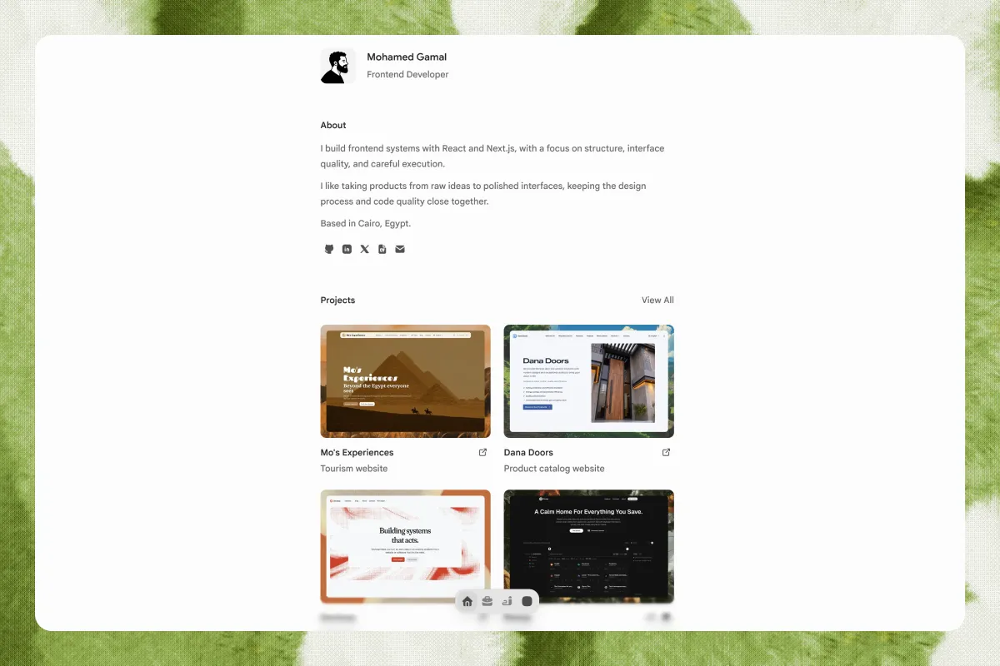

# Personal Portfolio

This is my personal portfolio and writing surface: a narrow, editorial site for showing the frontend work I build, the decisions behind it, and the things I am still learning.

I built it to make the important parts easy to find. Visitors can get a quick sense of who I am, browse selected projects, read longer notes about frontend work, and reach me without working through a decorative maze first.

The site is intentionally quiet. Text carries most of the interface, motion explains state and navigation, and every extra detail has to earn the space it takes.

## At a glance

|                      |                                                                                            |
| -------------------- | ------------------------------------------------------------------------------------------ |
| **Project**          | Mohamed Gamal’s personal portfolio and writing site                                        |
| **Primary audience** | People looking at my frontend work and technical writing                                   |
| **Content**          | Seven project pages and four writing posts, authored in MDX                                |
| **Current status**   | Active and maintained                                                                      |
| **Shape**            | Homepage, project archive, project detail pages, writing archive, and writing detail pages |

## Why I built it

Most portfolios try to make the work feel impressive before they make it understandable. I wanted this one to do the opposite.

The brief was simple: show who I am, what kind of frontend work I care about, what I have built, what I write about, and where to go next. That meant keeping the content close to the surface, giving projects and writing their own space, and treating the site itself as part of the work rather than a wrapper around it.

## The approach

I designed the site around a few rules:

- communicate intent within a few seconds;
- keep text as the main interface;
- use progressive disclosure instead of showing everything at once;
- keep navigation direct and persistent;
- fix shared behavior in shared systems instead of layering on page-specific exceptions.

The visual language follows the same direction: a centered content column, short headings, compact project cards, writing rows, subtle dividers, and restrained metadata. Dark mode is meant to feel like a reading surface, not a second personality.

## What I built

### A personal homepage

The homepage brings together identity, selected work, writing, approach, social links, and contact. It is authored through shared content records so the same information can be reused consistently across the site.

### A project archive and detail system

Projects live in [`content/projects`](./content/projects) as MDX documents. The archive gives each project a compact entry point, while dedicated pages provide room for the starting point, decisions, implementation, and technology behind the work.

### A writing surface

Writing follows the same MDX-backed model in [`content/writing`](./content/writing). Posts cover frontend patterns, discovery, search visibility, and the practical reasoning that usually gets lost between a bug and its fix.

### A discovery and metadata layer

The site generates route metadata, canonical URLs, JSON-LD, Open Graph images, a sitemap, robots instructions, and a manifest. It also exposes [`llms.txt`](./app/llms.txt/route.ts) and [`llms-full.txt`](./app/llms-full.txt/route.ts) routes that turn the site’s content into a clearer machine-readable reference.

### Small interaction systems

The floating dock, article chrome, table of contents, page actions, contact copy feedback, theme controls, minimal sounds, and page transitions are all there to support orientation and feedback. They are not meant to compete with the writing.

## Current status

This is an active personal project rather than a frozen case-study artifact. The current repository contains:

- seven project MDX files: Dana Doors, Devloop, Forge, Markymap, Mo’s Experiences, Reway, and Rootly;
- four writing MDX files;
- project and writing cover images under [`public/assets`](./public/assets);
- shared content, metadata, motion, audio, article, and navigation systems;
- local development and validation scripts through pnpm.

## Technology

- Next.js 16 App Router
- React 19
- TypeScript 5
- Tailwind CSS 4
- Fumadocs MDX
- Motion
- Base UI via `@base-ui/react`
- `next-themes`
- `@web-kits/audio`
- pnpm

The important part of the stack is the separation of concerns: [`app`](./app) owns routes, [`components`](./components) owns reusable interface pieces, [`content`](./content) owns authored material, and [`lib`](./lib) owns content loading, metadata, navigation, motion, design tokens, and audio helpers.

## Run it locally

```bash
pnpm install
pnpm dev
```

Useful checks:

```bash
pnpm format:check
pnpm lint
pnpm typecheck
pnpm build
```

## Project notes

The project direction and constraints live in [`spec/index.md`](./spec/index.md). Session continuity lives in [`spec/sessions`](./spec/sessions), and the repository’s available agent skills are indexed in [`spec/skills.md`](./spec/skills.md).

Those documents are part of how I work on the site: they keep the product direction, writing tone, and implementation decisions close enough to the code that the portfolio can keep changing without losing its shape.
